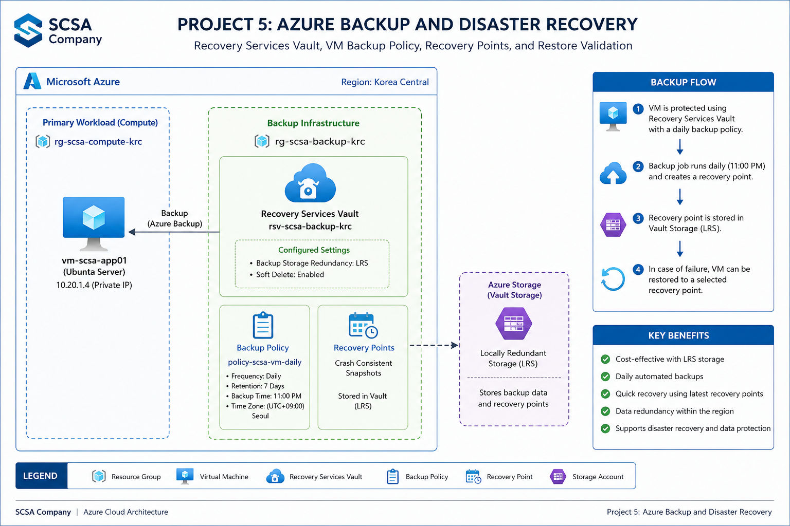

# SCSA Company – Project 5: Azure Backup and Disaster Recovery

## Project Overview

This project implements Azure Backup and recovery capabilities for the SCSA Company Azure application server.

The objective was to protect the existing Linux virtual machine, `vm-scsa-app01`, using Azure Backup while keeping the design cost-conscious and suitable for a small cloud environment.

The project includes:

- Recovery Services Vault deployment
- Locally Redundant Storage (LRS) for backup storage
- Custom daily VM backup policy
- Azure VM backup protection
- On-demand backup
- Recovery point validation
- Restore workflow validation
- Backup health verification
- Azure CLI automation
- Cost-conscious retention design

---

## Business Scenario

SCSA Company already has an Azure-hosted application server from Project 2.

Previous projects introduced:

- Network security
- Compute infrastructure
- Storage and data protection
- Monitoring and alerts

However, monitoring alone cannot recover a virtual machine if the workload becomes corrupted, accidentally deleted, or requires rollback to a previous state.

SCSA therefore required a backup and recovery solution that could:

- Protect the application server
- Create recoverable VM states
- Retain backups for a defined period
- Support administrator-initiated recovery
- Minimize unnecessary storage costs

Azure Backup was selected to provide centralized backup management using a Recovery Services Vault.

---

## Architecture

### Region

`Korea Central`

The protected VM already exists in Korea Central, so the Recovery Services Vault was also deployed in Korea Central.

Azure VM Backup requires the Recovery Services Vault and protected VM to be located in the same Azure region.

---

## Azure Resources

### Existing Compute Resource Group

`rg-scsa-compute-krc`

Contains:

- `vm-scsa-app01`

### Backup Resource Group

`rg-scsa-backup-krc`

Contains:

- `rsv-scsa-backup-krc`

### Recovery Services Vault

`rsv-scsa-backup-krc`

### Backup Policy

`policy-scsa-vm-daily`

### Protected Workload

`vm-scsa-app01`

---

## Backup Design

The backup design uses a dedicated Recovery Services Vault to manage protection for the SCSA application server.

The simplified backup flow is:

`vm-scsa-app01 → Azure Backup → Recovery Services Vault → Recovery Point → Restore`

The Recovery Services Vault manages:

- Backup policies
- Protected workloads
- Backup jobs
- Recovery points
- Restore operations

Creating the vault alone does not protect a workload.

Backup protection must be explicitly enabled for the virtual machine using a backup policy.

---

## Recovery Services Vault

A Recovery Services Vault was created in Korea Central:

`rsv-scsa-backup-krc`

The `Microsoft.RecoveryServices` resource provider was registered before deployment because the subscription had not previously used Recovery Services resources.

---

## Backup Storage Redundancy

The vault backup storage redundancy was configured as:

`LocallyRedundant`

The configuration was validated with:

- Storage Redundancy: `LocallyRedundant`
- Storage State: `Unlocked`

LRS was selected for this lab because the project uses a single low-cost development workload and does not require cross-region backup replication.

For a production environment, backup redundancy should be selected based on business continuity, compliance, recovery, and resiliency requirements rather than cost alone.

---

## Backup Policy

A custom VM backup policy was created:

`policy-scsa-vm-daily`

Configuration:

| Setting | Value |
|---|---|
| Backup Management Type | AzureIaasVM |
| Frequency | Daily |
| Daily Retention | 7 days |
| Time Zone | UTC |

The policy was based on Azure's default virtual machine backup policy.

The default policy JSON was exported and modified so that the daily retention period was reduced from 30 days to 7 days.

This approach ensured compatibility with the Azure CLI policy schema while maintaining a lightweight retention configuration for the lab.

---

## Backup Protection

Backup protection was enabled for:

`vm-scsa-app01`

The virtual machine resides in:

`rg-scsa-compute-krc`

The Recovery Services Vault resides in:

`rg-scsa-backup-krc`

Because the VM and vault exist in different resource groups, the VM resource ID was used when enabling protection.

The configuration job completed successfully:

| Operation | Status | Item |
|---|---|---|
| ConfigureBackup | Completed | vm-scsa-app01 |

At this point, the VM became an actively protected backup item.

---

## On-Demand Backup

An on-demand backup was triggered instead of waiting for the next scheduled daily backup window.

The backup job completed successfully:

| Operation | Status | Item |
|---|---|---|
| Backup | Completed | vm-scsa-app01 |

The initial backup required more time than later incremental backups because Azure had to establish the first recovery point for the protected virtual machine.

---

## Recovery Point Validation

After the backup job completed, the available recovery points were queried.

A valid recovery point was successfully created for:

`vm-scsa-app01`

The recovery point consistency type was:

`CrashConsistent`

A crash-consistent recovery point represents the disk state of the virtual machine without application-level coordination.

This type of recovery point is comparable to restoring the disks after an unexpected power interruption.

---

## Restore Validation

The Azure Portal restore workflow was reviewed using the generated recovery point.

The recovery point was selectable for VM restoration.

The restore workflow confirmed that Azure Backup could use the available recovery point for recovery operations.

A full restore was intentionally not performed because doing so would create additional Azure resources and unnecessary lab costs.

The project therefore validated the recovery workflow without deploying a duplicate virtual machine.

---

## Backup vs High Availability

Azure Backup provides recovery capability but is not the same as high availability.

### Backup

Backup answers:

> How can the workload or data be recovered after loss, corruption, or deletion?

### High Availability

High availability answers:

> How can the service remain available when infrastructure fails?

A backup recovery process may involve downtime.

A highly available architecture typically uses technologies such as:

- Multiple virtual machines
- Availability Zones
- Load Balancers
- Redundant application instances

This project focuses on backup and recovery rather than full workload high availability.

---

## RPO and RTO

### Recovery Point Objective (RPO)

RPO defines the maximum acceptable amount of data loss measured in time.

Example:

If a business can tolerate losing no more than four hours of data, its RPO is four hours.

### Recovery Time Objective (RTO)

RTO defines the maximum acceptable amount of time required to restore service after an outage.

RPO therefore focuses on:

`Data Loss`

RTO focuses on:

`Downtime`

---

## Restore Options

Azure VM Backup can support different recovery approaches depending on the incident.

Examples include:

### Restore Virtual Machine

Creates or recovers a VM from a selected recovery point.

### Restore Disks

Restores managed disks from a recovery point for customized recovery operations.

### Replace Existing Disks

Uses a recovery point to replace the disks attached to an existing VM.

### File-Level Recovery

Allows individual files or folders to be recovered without restoring the entire virtual machine in supported scenarios.

The correct restore method depends on the recovery requirement.

---

## Final Backup Validation

The protected backup item was validated using Azure CLI.

Final state:

| Setting | Value |
|---|---|
| VM | vm-scsa-app01 |
| Protection State | Protected |
| Health Status | Passed |
| Backup Policy | policy-scsa-vm-daily |

This confirmed that the virtual machine was successfully protected and operating under the intended backup policy.

---

## Security and Data Protection

The Recovery Services Vault reported the following backup protection features during validation:

- Soft Delete: Enabled
- Soft Delete Retention: 14 days
- Enhanced Security: Enabled

Soft delete provides additional protection against accidental or malicious deletion of backup data.

The backup design also avoids storing credentials or subscription identifiers inside reusable scripts.

---

## Cost Management

The project was designed to minimize Azure consumption.

Cost-conscious decisions included:

- Using one existing virtual machine
- Using LRS rather than GRS for the lab
- Using a seven-day retention period
- Creating only one recovery point for validation
- Avoiding a full VM restore
- Avoiding duplicate recovery infrastructure
- Reusing existing Project 2 compute resources
- Deallocating the VM when active compute is not required

In a production environment, backup retention and redundancy should be based on organizational recovery requirements rather than lab cost optimization.

---

## Troubleshooting

### Microsoft.RecoveryServices Provider Registration

Initial Recovery Services Vault creation failed with:

`MissingSubscriptionRegistration`

The subscription had not yet registered the following resource provider:

`Microsoft.RecoveryServices`

The provider was registered before the vault deployment was retried.

---

### Backup Policy JSON Parsing

The initial manually created policy JSON failed with an Azure CLI error related to:

`backup_management_type`

Instead of manually defining the complete policy schema, Azure's default VM backup policy was exported using:

`az backup policy get-default-for-vm`

The default object was then modified to reduce daily retention from 30 days to 7 days.

This provided a valid policy structure compatible with the installed Azure CLI version.

---

### Explicit Backup Management Type Requirement

The installed Azure CLI version required:

`--backup-management-type AzureIaasVM`

when creating the backup policy.

Adding the explicit backup management type allowed the custom policy to be created successfully.

---

### On-Demand Backup Date Format

The initial `--retain-until` value was supplied using ISO date format.

The installed Azure CLI expected:

`DD-MM-YYYY`

The date format was corrected before retrying the backup operation.

---

### Initial Backup Duration

The first VM backup remained in:

`InProgress`

for an extended period.

This was expected because the initial backup establishes the first recovery point and may require more processing than subsequent incremental backups.

The operation was allowed to continue without cancellation and eventually completed successfully.

---

### Azure CLI Backup Job Detail Error

The following command encountered a CLI-side error while attempting to inspect the running backup job:

`az backup job show`

The CLI returned a Python `NoneType` error involving:

`extended_info`

The actual Azure Backup operation was not failed.

Backup status was therefore monitored using:

`az backup job list`

The job later completed successfully.

This demonstrated the importance of distinguishing Azure resource state from local CLI tooling errors.

---

## Implementation

The project was implemented primarily using Azure CLI.

### Deployment Scripts

- [01-resource-group.sh](./scripts/01-resource-group.sh) – Creates the dedicated backup resource group.
- [02-recovery-services-vault.sh](./scripts/02-recovery-services-vault.sh) – Registers Microsoft.RecoveryServices and creates the Recovery Services Vault.
- [03-vault-storage-redundancy.sh](./scripts/03-vault-storage-redundancy.sh) – Configures the vault for Locally Redundant backup storage.
- [04-backup-policy.sh](./scripts/04-backup-policy.sh) – Exports Azure's default VM policy, modifies retention, and creates the custom SCSA policy.
- [05-enable-vm-backup.sh](./scripts/05-enable-vm-backup.sh) – Enables Azure Backup protection for the existing application VM.
- [06-on-demand-backup.sh](./scripts/06-on-demand-backup.sh) – Triggers an on-demand VM backup.
- [07-recovery-point-validation.sh](./scripts/07-recovery-point-validation.sh) – Lists and validates available VM recovery points.
- [08-final-validation.sh](./scripts/08-final-validation.sh) – Validates VM protection state, backup health, and assigned policy.

---

## Implementation Evidence

Screenshots are available in the [`screenshots`](./screenshots/) directory.

Evidence includes:

1. Backup resource group
2. Recovery Services Vault
3. Vault storage redundancy
4. Custom VM backup policy
5. VM backup protection
6. Completed on-demand backup job
7. Recovery point validation
8. VM restore workflow
9. Final backup protection validation

---

## Skills Demonstrated

- Azure Backup
- Recovery Services Vault
- Azure VM Backup
- Backup Policies
- Backup Retention
- Recovery Points
- Restore Workflows
- Backup Job Monitoring
- Backup Storage Redundancy
- Locally Redundant Storage
- Soft Delete
- Azure Resource Providers
- Azure CLI
- JSON policy manipulation
- Linux workload protection
- Backup troubleshooting
- RPO and RTO concepts
- Cost-conscious Azure administration
- Disaster recovery planning
- Infrastructure documentation

---

## Project Status

**Completed**

SCSA Company now has a centralized Azure backup and recovery solution for its Linux application server.

The protected workload uses a custom daily backup policy, short-term recovery point retention, Locally Redundant vault storage, backup health validation, and a verified restore workflow.

This project extends the SCSA Azure environment from monitoring and operational visibility into workload recovery and disaster recovery preparedness.
